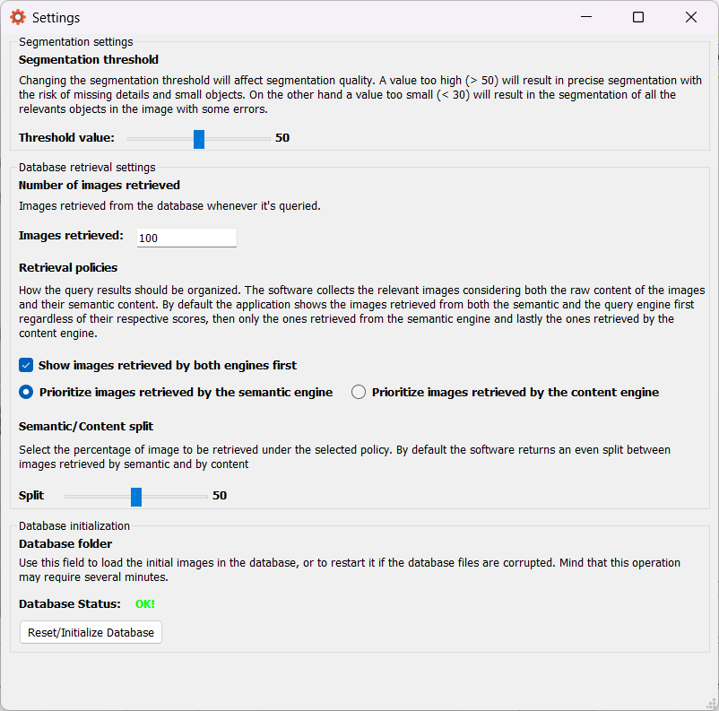

# ImaginAItion

ImaginAItion is a small app for image retrieval that I developed as the final project for the Multimedia Data Management course at the University of Bologna.
The app's feature are:
- Add images to the app's database
- Automatic image segmentation
- Image retrieval using semantic and content features computed with AI

## Models used

To achieve this result 3 different models are used:
- **DeepLab**: To automatically segment images. I used the [pytorch implementation](https://pytorch.org/hub/pytorch_vision_deeplabv3_resnet101/) with ResNet101 backbone.
- **CLIP**: To compute semantic encoding. This seemed a good idea since CLIP is trained with both images and their description, that naturally encodes semantic meaning.
The semantic information is encoded with a 512-d vector.
- **Autoencoder**: A simple autoencoder architecture developed and trained by me to encode the content information of the image.
The content information is encoded with a 1024-d vector.

### The autoencoder

The autoencoder implementation is pretty straightforward and is composed by 3x3 convolutions + ReLU and BatchNorm blocks followed
by MaxPool downsampling. The upsampling strategy of the decoder is implemented with transposed convolutions. Here's the diagram of its architecture.

<figure>
  
  <figcaption><i>Autoencoder architecture</i></figcaption>
</figure>
 
The model was trained on [TinyImageNet](https://www.kaggle.com/datasets/akash2sharma/tiny-imagenet) and accepts 3x64x64 images normalized with mean and std computed on the dataset training set.

## Similarity search

Similarity search is implemented with the help of the [FAISS](https://github.com/facebookresearch/faiss) library to efficiently perform 
k-nearest neighbor search. Semantic embeddings are saved in an index of size 512 and queried used L2 distance, while the content embeddings
are stored in an index of size 1024 and queried using L1 distance to mitigate a bit the sparisity uinduced by the bigger dimension.

## The App

### The main window

The main window is used to load an image, add it to the database (if needed) and search for similar images inside the database.
Once an image is loaded in the app the user can browse the various detected segmentation masks by clicking the items in the "detected labels" section.

<figure>
  
  <figcaption><i>Main window with an image loaded</i></figcaption>
</figure>
 
<figure>
  
  <figcaption><i>Segmentation mask inspection</i></figcaption>
</figure>
 
Pressing the "Add to database" button will store the image's relevant data to the FAISS indexes, while pressing "Search similar images"
will trigger the database query.

## The query viewer

Once the query button is pressed, a new window will open showing the result of the given query. The order of the results may
change according to setting chosen by the user (more on that in the next section!) but assuming default settings the app will:

- Query both indexes with the image's content representation and semantic representation and extract the 50 nearest neighbors for each
- Put at the top the images that appear both in the semantic and in the content result, sorted by decreased semantic similarity
- Put the semantic results sorted by decreasing semantic similarity
- Put the content results sorted by decreasing content similarity

The query viewer uses colors to encode the policy used to retrieve a given image:

- <b>Light blue:</b> For images that were retrieved by both the content index and the semantic index.
- <b>Green:</b> For images retrieved by the semantic index only.
- <b>Red:</b> For images retrieved by the content index only.

Here there are some results for the image shown above.

<figure>
  
  <figcaption><i>First results are the one retrieved by both indexes, and are fairly accurate</i></figcaption>
</figure>
 
<figure>
  
  <figcaption><i>Followed by the semantic-only results</i></figcaption>
</figure>
 
<figure>
  
  <figcaption><i>And lastly there are the content-only results that tend to be fairly imprecise</i></figcaption>
</figure>
 

## The settings

From the main window the user can access the settings by clicking Options -> Preferences and will be able to tune some aspects
of the application

<figure>
  
  <figcaption><i>The settings window</i></figcaption>
</figure>
 

From this window the user can:

- Modify the threshold used to compute the segmentation maps using DeepLab's output. A higher value will result in very precise
masks that will miss details here and there. A lower threshold will obtain the opposite effect.
- Modify how many images are retrieved in the query.
- Turn off the precedence given to image retrieved by both indexes.
- Decide to prioritize either the content index results or the semantic index results.
- How many images are retrieved using the preferred policy out of the k chosen.
- Reset/Reinitialize the database

## Database reset/initialization

Clicking on the "Reset/Initialize database" button will open the following window

<figure>
  
  <figcaption><i>The reset database window</i></figcaption>
</figure>
 
Upon choosing a folder **that contains only images** the ap will copy them, compute their representation and store them in the faiss indexes.
When this window closes the database is ready to be used.